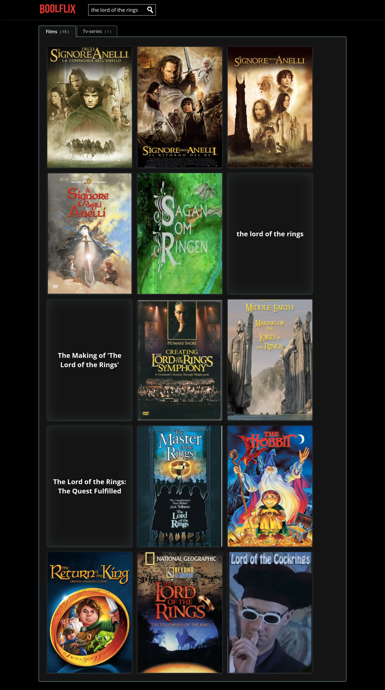
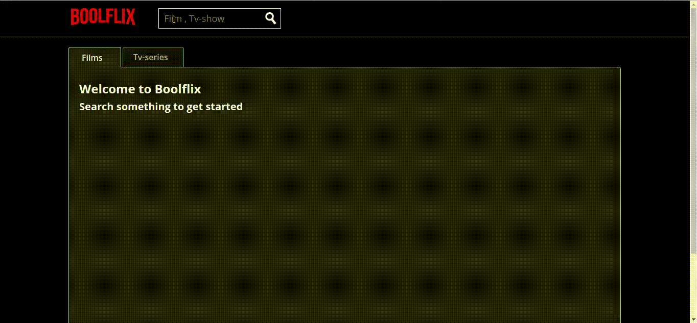

# Boolflix

A Movie and Tv-show searching website with a design inspired by Netflix.

## Laguages & Technologies
HTML, CSS, Flex, <br>  <b>Javascript, Jquery, AJAX, API, Hadlebars.js, </b><br>
<b>themoviedb.org</b> Database<br>

## Functionality

<p>Gives the user the possibility to search for movies and tv-series by title.
The results are then organized by pages and divided into two main folders (movies and tv-series).</p>
<p>The user can access the first set of general info present in each one of the movie cards by clicking on a movie poster, he can then access a more detailed set of info that appears in the center of the page as can be seen [here](#animation).</p>


##### Details

- The movies data are  retrieved from themoviedb.org Database through an API call
- The movie cards,  advanced info panel, and the pages display the managed by the use of Handlebars.js.

## Important note


The API call to the database requires an api_key provided by movie.org upon registration to the website.
If the website doesn't showcase results properly it might be because the key has been deactivated.
<p>If so you can use your own api_key by sobstituting it the on <br> <b>line 251 of /script.js</b> </p>

```
var outData = {

  api_key: "be7a5b068bb701d40ef499c039960c53", (<--here)
  language: "it-IT",
  query: search,
 }d

```
## Screenshots

<details open>
<summary>Full page</summary><br>

</details><br>
<details open>
<summary>More info</summary><br>

</details><br>

### Animation

